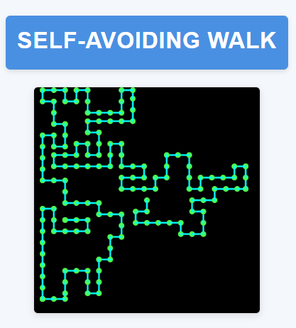

# Self-Avoiding Walk

## 🚀 Sobre o Projeto

Este projeto implementa uma visualização interativa de um "Self-Avoiding Walk" (Caminhada Auto-Evitante), um conceito matemático onde um caminhante se move em uma grade, nunca visitando a mesma posição duas vezes. Este projeto foi inspirado no vídeo do canal **The Coding Train**, que você pode assistir [aqui](https://youtu.be/m6-cm6GZ1iw?si=g3c8ZcHUzDjpAVk9).

## 📸 Exemplo

<div align="center">
  
</div>

## 📋 Características

- Visualização em tempo real do caminho percorrido
- Grade dinâmica com movimento automático
- Detecção de situações sem saída
- Interface visual com feedback através de notificações Toast
- Renderização suave com P5.js
- Design responsivo com Bootstrap

## 🛠️ Tecnologias Utilizadas

- HTML5
- CSS3
- JavaScript
- P5.js para renderização gráfica
- Bootstrap 5.3.3 para componentes UI
- Biblioteca P5.sound.min.js para futura implementação de áudio

## 🔧 Instalação e Execução

1. Clone o repositório:

```bash
git clone https://github.com/sj-silva/self-avoid-walk.git
```

2. Abra o arquivo `index.html` em um servidor web local

3. Alternativamente, use um servidor de desenvolvimento como Live Server do VS Code

## 📦 Estrutura do Projeto

```

/self-avoiding-walk
│
├── index.html # Página principal
├── main.js # Lógica principal do projeto
├── style.css # Estilos CSS
└── README.md # Esta documentação

```

## 🎮 Como Funciona

O programa cria um "caminhante" que:

- Inicia no centro da tela
- Move-se automaticamente a cada 200ms
- Só pode mover-se para posições não visitadas
- Deixa um rastro visual do caminho percorrido
- Para quando não há mais movimentos possíveis

## ⚙️ Configurações

Principais constantes que podem ser ajustadas em `main.js`:

```javascript
const WINDOW_WIDTH = 400; // Largura da janela
const WINDOW_HEIGHT = 400; // Altura da janela
const RELOAD_INTERVAL = 5000; // Intervalo de recarga
const MOVE_INTERVAL = 200; // Intervalo entre movimentos
```

## 🎨 Personalização

As cores podem ser modificadas alterando o objeto `color` em `main.js`:

```javascript
const color = {
  line: { r: 0, g: 255, b: 255 }, // Cor da linha (ciano)
  point: { r: 80, g: 255, b: 80 }, // Cor do ponto (verde limão)
};
```

## 🚨 Tratamento de Erros

- O programa detecta automaticamente quando o caminhante fica sem movimentos possíveis
- Uma notificação Toast do Bootstrap é exibida quando isso acontece
- O usuário pode recarregar a página para iniciar uma nova caminhada

## 📄 Licença

Este projeto está sob a [Licença MIT](https://opensource.org/licenses/MIT).
